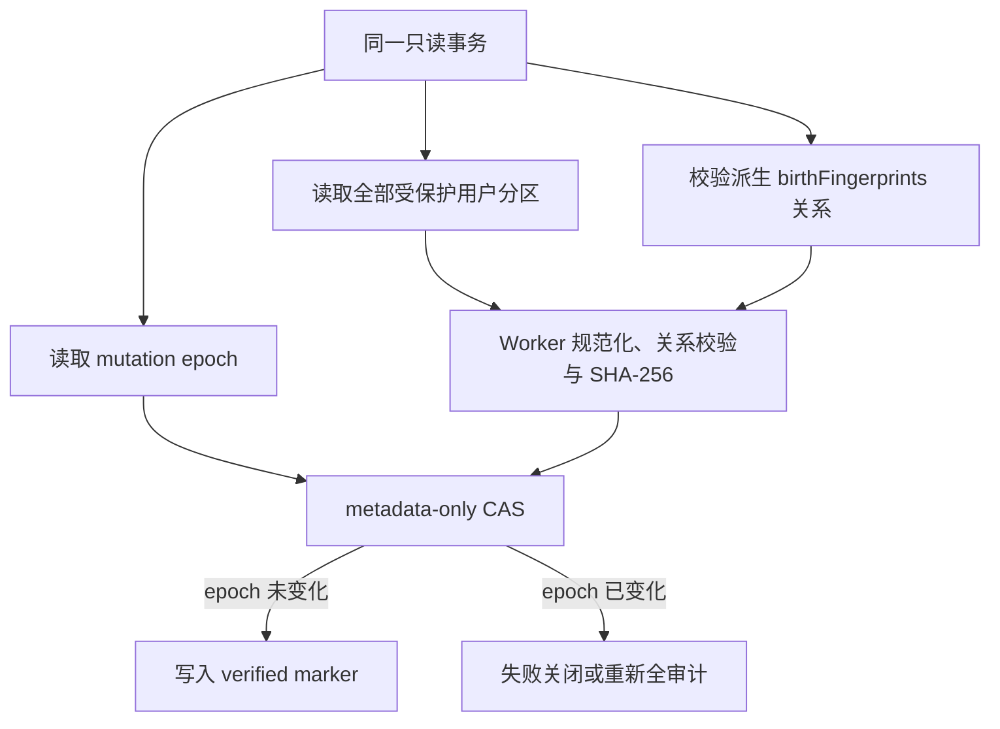

# P2-05 原子完整性审计协议 v0.1

> 状态：Schema 16 隔离候选；不得据此提升默认发布代际。  
> 默认构建：继续使用 `legacy-v13`；Schema 16 只能输出到独立 `tmp` 目录并通过专用迁移门。

## 1. 问题与指标口径

固定 Edge 工作站上的 10,000 Case 容量门已经证明案例内容可在约 0.55～2.45 秒内渲染，但启动完成前应用内容仍有 `inert`，用户不能操作。现有启动链每次都读取全部用户分区并执行 full backup 级 Worker 审计，真正解除 `inert` 约需 15～17 秒，因此 5 秒交互目标尚未通过。

曾验证过“同 build 先发送 `BOOT_OK`、空闲时再审计”的实验方案。该方案已撤回，原因是发布收据摘要只代表迁移或提交时的快照，不能证明用户后续写入后的实时数据；页面内存写锁也不能覆盖刷新、关闭或其他标签页。

## 2. 安全目标

Schema 16 必须同时保持以下不变量：

1. 每个实际修改业务 store 并提交的读写事务至多且至少推进一次持久化 mutation epoch；唯一例外是显式“清空全部本地数据”，它在同一事务末尾删除 `mutationState`，使下一次启动回到未验证的 epoch-zero 并强制全量审计。
2. epoch 更新与业务写入位于同一个 IndexedDB 事务；事务中止时必须一起回滚。若调用方捕获单个请求失败并主动让事务提交，允许只留下保守的 dirty epoch，绝不允许成功业务写入漏记。
3. release write lock 在 epoch 更新和业务写入之前生效；迁移旁路能力只绑定一个明确获授权的 Dexie/IndexedDB 事务，不能被同连接上的无关并发写借用。
4. 全量 payload、派生 `birthFingerprints` 关系和 epoch 必须来自同一只读事务的一致快照。
5. Worker 完整审计成功后，只能用 `expectedEpoch` CAS 写入 verified marker；期间发生任何业务写入都使 CAS 失败。
6. 快速启动只接受 `verifiedEpoch === epoch`，并且 generation、数据库名、Schema、build、应用版本、备份格式和验证协议身份全部精确一致。
7. marker 缺失、损坏、dirty、身份变化或审计失败时继续执行当前 fail-closed 全量审计，不发送 `BOOT_OK`。
8. mutation state 是运行元数据，不进入用户 full backup，也不得改变备份摘要。
9. 默认 v13、隔离 v15 候选和现有备份格式不得因 Schema 16 候选发生行为漂移。

## 3. Schema 16 状态

业务数据库新增内部 singleton store：

```text
mutationState: "&id"
id = "current"
protocolVersion = 1
epoch = non-negative safe integer
verifiedEpoch = null | epoch at last successful audit
verifiedPayloadDigest = null | lowercase SHA-256
verifiedContractVersion = null | exact verifier/release identity
verifiedAt = null | canonical ISO instant
```

空 store 表示尚未建立 epoch-zero 基线，不能直接快速启动。首个全量审计成功后才可通过 CAS 建立 clean marker。业务写入只推进 `epoch`，保留旧 verified marker 作为历史证据；只要二者不相等就视为 dirty。隐私清空会在清空全部业务 store 后删除该运行元数据，因此下一次启动同样必须从 epoch-zero 做完整审计，不能把“空库”直接视为 clean。

## 4. 事务协议

### 4.1 业务写入

Dexie DBCore middleware 对 Schema 16 的每个 `readwrite` 事务自动加入 `mutationState` store。该事务第一次修改非 metadata store 时：

1. 先检查 release write lock；
2. 读取并严格解析 singleton；
3. 将 epoch 加一；
4. 再转发业务 mutate；
5. 同一 DBCore transaction 的后续 mutate 复用同一个 bump promise。

显式 throw 或 `transaction.abort()` 时，epoch 和所有业务写入一起回滚。被调用方捕获的单个约束失败可能使事务只提交 epoch；这是安全的假阳性 dirty 状态，只会触发额外审计。多个数据库连接依赖 IndexedDB 对同 store 的 readwrite 事务串行化，不能用页面内存计数替代持久化事务。迁移写权限以获授权事务的原生 `IDBTransaction` 身份登记；`Dexie.ignoreTransaction()` 发起的无关写使用不同事务，仍会被 release write lock 拒绝。

### 4.2 全量审计与 CAS



CAS 只能更新 `mutationState`，不得再次推进 epoch。发布迁移期间数据库仍处于写锁；Coordinator 只能在一个显式、事务级的 migration write capability 内物化目标或提交该 metadata，权限不会在异步等待期间扩散到无关事务。

### 4.3 启动判定

启动时先严格读取 singleton：

- clean 且 contract 精确匹配：使用已验证 digest 继续当前发布回执与 Service Worker 双重确认；
- marker 缺失或 dirty：执行原子全量审计并 CAS；
- marker 损坏、CAS 竞争失败或 Worker 审计失败：启动失败关闭，不解除写锁、不发送 `BOOT_OK`。

`committedDigest`、相同 build、页面内存锁或定时/空闲回调均不能单独构成快速启动证据。

## 5. 发布与迁移路线

当前真实默认用户仍在 v13，因此公开候选只维护 **v13 → v16 直升**：

- v14 活动流索引、v15 Revision 计算收据和 v16 mutation state 在一次影子迁移中形成；
- 不创建中间 v14/v15 物理数据库；
- v15 → v16 只作为 storage 相邻 Schema 单测，不同时维护为公开发布路线；
- 如果以后先正式发布 v15，则 v16 的唯一 source 必须改成 v15；一个描述符不能同时接受两个物理源代际。

## 6. 边界

- 受支持写入：所有通过当前 Dexie/Repository 路径的业务事务。
- 不受支持写入：DevTools、扩展或第三方脚本直接调用原生 IndexedDB 绕过应用中间件。该风险不由 epoch 单独解决，仍需构建身份、CSP/供应链审计和周期性全量审计。
- `birthFingerprints` 是可重建派生表，不进入用户备份；但 clean marker 建立前必须核对其与 Case/CandidateSet 的精确关系，不能因“不进备份”而跳过。
- epoch 证明“自上次审计以来没有受支持业务写入”，不证明命理算法正确；360 金标准和现实专家复核仍是独立发布门。

## 7. 必须通过的证据

Storage 定向门：

- 单 mutate、bulk、单条 delete、clear 与同事务多次 mutate 均已覆盖；每个提交事务只推进一次；
- 显式 throw 与 `transaction.abort()` 已证明业务行和 epoch 一起回滚；被捕获的请求失败允许保守推进，但成功写入绝不能漏记；
- release write lock 在 bump 前拒绝；
- 迁移写能力只属于获授权的 Dexie/IndexedDB 事务，同实例无关并发写不能借用；异步完整物化仍保持授权事务；
- 两个连接并发提交不丢 epoch；
- v15 → v16 不重写旧用户行；
- payload 与 epoch 原子快照、CAS 成功/竞争失败；
- fingerprint 缺失、多余或篡改失败关闭；
- mutation state 不进入 full backup payload，写入 verified marker 前后用户 payload 与摘要不变。

Web/发布门：

- missing、dirty、contract/build/schema/generation mismatch 都执行全审计；
- clean hit 不读取全部业务分区，且仍完成控制库和 Service Worker 回执复核；
- 全审计后 CAS 失败不能发送 `BOOT_OK`；
- v13 → v16 的首装、富数据、容量不足、多标签冻结、事务中止、目标审计失败、`BOOT_OK` 中断、陈旧目标、dirty CAS 竞争、同 ID 终态隔离、新 ID 长期重发和刷新收敛；
- 默认 `npm run build` 仍为 `legacy-v13`，Schema 16 只生成隔离候选；
- 固定 10,000 Case 的第二次 clean 启动真正解除 `inert` 小于 5 秒；dirty 启动仍可慢，但必须明确记录为完整审计。

## 8. 当前完成判定

当前 Schema 16 storage、Edge + Chrome 发布矩阵（2026-08-11 复跑 **26/26**，Edge 13/13 + Chrome 13/13，共约 11 分钟）、双浏览器 clean-start 容量（2026-08-11 复验通过）和默认构建身份都已有当前代码的可重复证据，因此可把隔离候选的“原子审计 + 安全快速启动 + 自然升级收敛”子门标为通过。普通构建仍是 `legacy-v13`，v16 不因此成为默认版本。专业 ResearchQuery 的用户取消现会中止全量快照只读事务并传入协作式执行器，取消后不提交半成品。P2-05 总门仍为部分完成：CandidateSet-heavy、长备注、专业查询容量、其他批量任务统一取消、内存/主线程 long task、存储连续深翻和固定中端 Android 尚未完成。工程复现、摘要一致和浏览器通过均不构成命理专家真值。

## 9. Schema 16 clean-start 容量门（2026-08-10 首次记录；2026-08-11 复验）

Microsoft Edge 与 Google Chrome 已分别完成隔离、生产协议级容量复验：

1. 现场构建冻结 `legacy-v13` 与隔离 `v13 → v16` 两个独立壳；
2. 只在物理 v13（IndexedDB native version 130）写入精确 10,000 Case、10,000 Revision 和 10,000 条匹配 Revision fingerprint；共享种子 helper 会拒绝对任何非 v13 数据库执行 raw IndexedDB 写入，未用绕过 epoch 的 raw 写入伪造 v16 数据；
3. v16 页面通过生产 shadow materialization、全量 Worker 审计、epoch CAS 和 `BOOT_OK` 完成首次提交；
4. 关闭全部页面后重新打开未变化 v16 数据库，测量 `appBootReady=true` 且主要内容没有 `inert` 的实际交互时间；
5. 再验证精确总数、收藏、回收站、稀有关键词检索和案例打开。

| 指标 | Edge 实测 | Chrome 实测 |
| --- | ---: | ---: |
| 首次 v13 → v16 migration + `full_audit` 实际交互就绪 | **37.692 s** | **35.498 s** |
| 首次 materialize 后 mutation epoch | `epoch = verifiedEpoch = 1` | `epoch = verifiedEpoch = 1` |
| 第二次 clean v16 实际交互就绪 | **1.072 s** | **1.066 s** |
| 第二次完整性判定 | `cache_hit` | `cache_hit` |

迁移前后精确保持：Case 10,000、Revision 10,000、fingerprint 10,000、活跃 9,912、回收站 88、活跃收藏 104；目标与稀有样本的 Case → latestRevision → fingerprint 关系均通过。第二次启动 mutation marker 与首次完全相同，证明 clean 启动没有产生业务写入或推进 epoch。单页实际挂载 50 行。两个浏览器的 clean 启动都达到 5 秒目标，但这只关闭隔离 v16 候选的 clean 数据子门；默认 v13 的阻塞全审计行为没有被改变。

2026-08-11 在当前工作区源码与同一固定工作站复验（机器负载明显高于 2026-08-10，首次迁移变慢，但 clean 交互仍远低于 5 秒预算）：

| 指标 | Edge 实测 | Chrome 实测 |
| --- | ---: | ---: |
| 首次 v13 → v16 migration + `full_audit` 实际交互就绪 | **82.496 s** | **74.638 s** |
| 首次 materialize 后 mutation epoch | `epoch = verifiedEpoch = 1` | `epoch = verifiedEpoch = 1` |
| 第二次 clean v16 实际交互就绪 | **1.300 s** | **1.213 s** |
| 第二次完整性判定 | `cache_hit` | `cache_hit` |

两次复验的计数与关系断言完全一致（Case 10,000 / Revision 10,000 / fingerprint 10,000 / active 9,912 / trash 88 / active favorites 104），clean 启动 marker 与首次完全相同。

自动证据：

- `apps/web/e2e/schema-v16-clean-start-capacity.spec.ts`
- `apps/web/e2e/case-library-capacity-helpers.ts`
- `apps/web/playwright.schema-v16-clean-start-capacity.config.ts`
- `npm run test:e2e:schema-v16-clean-start-capacity`（根命令固定 Edge 项目；Chrome 使用同一配置的 Chrome 项目复验）
- `apps/web/e2e/service-worker-cross-schema-v13-v16.spec.ts`
- `npm run test:e2e:cross-schema-v13-v16`
- `npm run test:e2e:web-v1-flow:v13-to-v16`
- 当前全量 Vitest：**147 个文件 / 1541 项**全部通过（2026-08-11 在 `--maxWorkers=2` 下复跑 191 秒通过；默认并行在本机长期高负载期间出现随机超时，单独重跑失败文件全部通过，判定为环境负载抖动而非代码回归）。

普通 `npm run build` 的最终产物仍为 `legacy-v13 / targetSchema 13`（2026-08-11 构建 hash `e69c67ad256c`）；Schema 16 只存在于独立候选目录，没有因容量或迁移门通过而提升为默认代。v13→v16 候选的 build/preview 脚本已改用 Vite 7 的 `--configLoader runner`（与紫微/西洋草案脚本一致），避免在受限环境中 esbuild 打包 TS 配置时读取父目录被拒绝；只影响配置加载方式，不改变发布描述符或产物语义。

### 9.1 多标签自然升级竞态已收敛

缺陷复现固定为两个同时存在的旧 v13 页面：一页已经完成 `BOOT_OK`，另一页已开始 10,000 数据慢审计但尚未发送 `BOOT_OK`；前者安装并促使新 v16 worker 接管。修复后，新 worker 仍不会接受旧代 `BOOT_OK` 来确认目标代，而是对尚未绑定目标代的合法旧页面返回明确的代际收敛信号。旧页保持 `inert` 和写锁，记录 `reload` 收敛原因并自动刷新；刷新后的页面只绑定已提交 v16，完成自身完整探针、`BOOT_OK` 与 ACK 后才解除写锁。

`test:e2e:cross-schema-v13-v16` 2026-08-11 在当前源码复跑：Edge **13/13（约 5.3 分钟）**、Chrome **13/13（约 5.1 分钟）**，共 **26/26**。矩阵覆盖：

1. 上述“双旧页 + 10k 慢审计 + 新 worker 接管”自然收敛；
2. 首个 v16 试运行页在源冻结被慢旧页拖过 5 秒时限后自动重试并完成收敛（2026-08-11 新增确定性复现：已确认 v13 页主线程被占用 8 秒，v16 页首次冻结失败后按 2～6 秒退避重试，随后完成迁移、`BOOT_OK`/ACK、写解锁，且不出现失败页）；
3. 全新浏览器从空 v13 建立 v16；
4. 富 v13 数据直升、业务写入变 dirty、全审计恢复 clean 与再次 cache hit；
5. 多个 v13 页面冻结和真实写入拒绝；
6. 容量不足时目标零创建、源指针不动且无 `BOOT_OK`；
7. 目标启动校验失败；
8. 目标完整审计摘要不符；
9. Dexie 迁移事务中止且不留下半代 mutation state；
10. control 已提交但 `BOOT_OK` 中断后的刷新收敛；
11. 陈旧页面持有 target `versionchange` 时失败关闭；
12. dirty 全审计期间受支持并发写使 CAS 失败，随后重新审计并命中 clean；
13. 隔离受阻后同 `migrationId` 只清理不续跑，新 `migrationId` 可长期重发。

2026-08-11 生产修复（最小、失败关闭）：`ReleaseDatabaseCoordinator` 对源冻结增加最多 5 次、2～6 秒退避的有界重试；对 `MIGRATION_SESSION_ACTIVE`/`LEASE_HELD` 等“同代迁移在途”竞争改为有界等待并自动绑定已提交代，而不是死页；失败路径的 `dbMigrationPhase` 不再错误停留在 `pending`（无 journal 的启动失败会明确标记 `failed`）；影子启动预算从 120 秒提高到 300 秒，覆盖 10k 首次迁移加在途等待。另修复了开发过程中引入的静态 `@hakimi/storage` 值导入（它会让 storage 在 `main.tsx` 设置 v13 运行时代际前被求值，把默认桥接库错建成 v14）；当前主入口对 storage 只保留动态导入，这是必须保持的启动顺序不变量。

`test:e2e:web-v1-flow:v13-to-v16` 在 2026-08-10 于 Edge 与 Chrome 各通过 1/1、共 **2/2（约 2.5 分钟）**，覆盖十六个用户分区全部非空、断网报告、全量清空、全新 context 恢复及稳定二次导出。2026-08-11 因本机持续高负载，单浏览器复跑在 45 分钟内未能完成，未宣称本轮新通过；该记录保留为历史证据。上述证据关闭当前 Chromium 候选的自然升级与连续数据子门，不代表 Firefox、固定 Android 或 Web v1 已完成，也不把工程复现、哈希一致或查询命中冒充命理专家真值。

### 9.2 P2-05 总门仍未关闭

P2-05 继续标记为“部分完成”。专业 ResearchQuery 已可真正中止正在执行的查询；2026-08-11 另新增 Edge + Chrome 真实浏览器重数据集门（60 候选组 + 40 条 6000+ 字符长备注经生产 full v1.2 恢复，单关键词/多关键词查询均 60 命中且摘要稳定、负向 0 命中，组合条件（月令/干支关系/规则快照/运限/事件绑定）双跑摘要稳定并显示“专家验证案例为 0”边界，另构造真实正向案例经生产恢复后组合查询精确命中 1 且摘要稳定，两浏览器各 4/4、共 8/8）、10,000 条真实浏览器完整 ZIP 导出取消门（两浏览器均无下载、无写入、计数不变）、5,000 行 / 4.7 MB CSV 真实浏览器预检取消门（两浏览器均零写入）、统一批量取消契约单测（备份产物/导入准备/CSV 解析/ResearchQuery 预中止失败关闭且不启动 Worker）与资源探针（存储/堆/long task）。发布签字前仍需更极端大库，以及固定中端 Android Chrome/WebView 同构容量证据。
