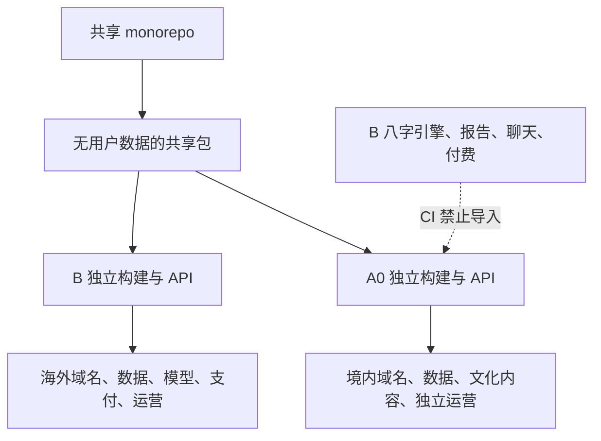

# 哈基米双产品技术架构 v0.1

> 日期：2026-08-01  
> 状态：方向基线，尚未进入代码开发  
> 核心决定：**一套 monorepo，两套独立生产平面；B 先发，A0 后发。**
> **更新说明：** 当前只推进 B 专业研究版，Web/PWA 先行、Android 后续优先；A0 双生产平面暂不进入本轮实施。最新技术顺序见 [产品方向更新 v0.2](./产品方向更新-v0.2-专业研究版.md)。

## 1. 为什么不是一个产品加“地区开关”

B 海外版包含个性八字、AI 解读与付费专题；A0 大陆版是历法文化、生活记录和开放式反思。两者的产品实质、允许字段、提示词、数据和收费边界不同。

因此只共享经过版本管理的源码和无用户数据的静态资产，不共享生产数据库、账户租户、模型端点、支付、分析 ID、CMS 或发布权限。禁止用 IP、前端开关或换文案把同一构建物在 B/A 间切换。



## 2. 产品与年龄矩阵

| 产品 | 首版用户 | 实质功能 | 状态 |
| --- | --- | --- | --- |
| B 海外版 | 18～35 岁 | 八字排盘、依据条、专题报告、AI 追问、获准后的付费 | 主产品，先验证和发布 |
| A0 大陆版 | 18～35 岁 | 历法文化、现实复盘、生活记录，不收出生资料 | 同期做小原型，独立预审后发布 |
| 青少年文化模式 | 15～17 岁 | 非个性化文化知识与通用反思 | 后续独立评估，不进入 B MVP |
| A1 候选 | 18～35 岁 | 只展示个人历法结构的候选方案 | 具体页面与输出获实质预审后才立项 |

15～17 岁模式不包含出生年月时地、个人排盘或预测、AI 个性化、自由对话、支付、营销、画像、推送和长期记忆。完整 B 产品的年龄门由服务端执行，不能只在前端隐藏入口。

## 3. 推荐目录边界

```text
apps/
  global-pwa/             # B：海外响应式 Web/PWA
  cn-culture-pwa/         # A0：大陆文化与生活志 Web/PWA

services/
  global-api/             # B 独立 API、数据与模型调用
  cn-culture-api/         # A0 独立 API、数据与内容策略

packages/
  design-foundations/     # 原创设计令牌与无障碍基线
  pwa-shell/              # PWA 安装、离线壳、响应式框架
  calendar-core/          # 时间、时区和纯历法标准化接口
  privacy-kit/            # 同意、导出、删除的实现代码
  safety-taxonomy/        # 高风险主题分类，不含市场提示词
  observability-schema/   # 无业务内容的事件结构

  global-chart-adapter/   # B：完整八字适配器
  global-chart-schema/    # B：ChartFacts 与规则版本
  global-content-policy/  # B：提示词、知识库、评测与拒绝策略
  global-reporting/       # B：报告、聊天、权益和付费接口

  cn-policy/              # A0：允许/拒绝能力清单
  cn-calendar-safe-view/  # A0：节气与历法字段白名单
  cn-reflection/          # A0：文化阅读、生活志和开放式问题
```

命名中的 `global` 和 `cn` 只用于工程辨识，正式产品名在品牌阶段另定。

## 4. 共享与隔离矩阵

| 层 | 可以共用 | 必须隔离 |
| --- | --- | --- |
| 工程 | monorepo、类型、Lint、测试与 CI 模板 | 构建物、发布流水线、回滚权限 |
| UI | 基础控件、无障碍、响应式规则、PWA 壳 | 导航、页面组合、文案、内容状态；不能只换主题色 |
| 历法 | IANA 时区规范化、纯历法基础、测试向量 | B 完整排盘；A0 只部署安全字段适配器 |
| AI | 风险分类和审计结构 | 提示词、知识库、模型端点、API key、评测集 |
| 身份 | 身份系统的实现代码 | OAuth client/issuer、账户租户、会话 Cookie |
| 数据 | Schema 工具与迁移框架 | DB、Bucket、备份、KMS key、日志、分析 ID |
| 支付 | 抽象接口 | 商户、币种、SKU、Webhook、权益、退款账本 |
| 运营 | 后台基础组件 | CMS、客服队列、运营账号与 RBAC |

v1 中同一邮箱可以在 A/B 分别注册，但不得自动关联。后续若做跨区账户连接，必须重新取得明确同意并完成数据跨境评估。Cookie 使用各自 Host-only 范围，不设置共享父域 Cookie。

## 5. 服务端能力控制

每个访问令牌至少包含：

```text
product       = global-b | cn-a0
market        = 具体地区代码
age_class     = minor-cultural | adult
policy_version
```

每个 API 在服务端复核这些声明。客户端功能开关只改善体验，不承担授权。IP 只作为风险信号，并与账户声明、手机号或支付地区组合判断；信息冲突时进入受限落地页，而不是直接进入 B。

A0 的 CI 和部署门直接禁止导入或连接：

- `global-chart-adapter` 与完整命盘 Schema；
- B 的提示词、知识库、报告与聊天包；
- B 的支付与权益包；
- B 的数据库、模型端点、分析项目和 CMS。

A0 生产构建里不是“按钮关闭”，而是根本不存在这些路由、代码和权限。

## 6. 排盘数据流

```text
用户出生资料
  → 时间精度与用途确认
  → IANA 时区 / DST / 城市粗粒度标准化
  → 自有 CalendarCore / ChartService
  → 固定版本的开源计算依赖
  → 自有 ChartFacts 字段白名单
  → 规则证据层
  → 去身份化结构给 AI 组织语言
  → 依据条展示“算得出 / 怎么解 / 怎么说”
```

业务页面不得直接调用第三方历法库。每份命盘记录：

- `engine_name`、`engine_version` 与上游提交；
- `tzdb_version`；
- `rule_profile`；
- 输入时间精度与未知字段；
- 计算时间与结果 Schema 版本。

首版只允许 `ChartFacts` 暴露标准化时间、四柱、藏干、十神、五行结构和经顾问确认的大运基础数据。吉凶、宜忌、灾煞、健康、财富和确定性预测字段不从依赖库直接穿透到产品。

## 7. GitHub 代码采用决定

### 7.1 计算层

- **首选技术验证：** [`6tail/lunar-typescript`](https://github.com/6tail/lunar-typescript)。本轮在固定提交上构建成功并通过 272 项测试；以依赖方式放在自有适配层后，不复制整站代码。
- **同源替代候选：** [`6tail/lunar-javascript`](https://github.com/6tail/lunar-javascript)。MIT 且无声明运行时依赖，可在样机阶段与 TypeScript 版做包体、API 和边界日期对比；公开 issue 中的时区与节气边界问题必须进入金标准，而不是假设已解决。
- **差分参考：** [`hoonsikim/saju`](https://github.com/hoonsikim/saju) 与 [`Zijian-Ni/tianji`](https://github.com/Zijian-Ni/tianji)。只用于边界样例和交叉校验，不作为唯一真相源。
- **不采用：** 无根 LICENSE、只有 README 许可声明、测试不足或包含大量健康/投资/灾祸预测的整站项目。

在两个 6tail 候选中最终选一个，不同时把两套生产依赖塞进客户端。选择标准是金标准正确率、时区处理、包体、维护性和许可证来源审计，不是 GitHub Star 数。

### 7.2 UI 层

- 移动 PWA 外壳优先评估 [`ant-design-mobile`](https://github.com/ant-design/ant-design-mobile)（MIT），复用 Form、Picker、Popup、Tabs、TabBar、SafeArea 等通用交互；
- 不使用默认蓝色主题，全部映射到“一纸四时”的原创令牌；
- 四柱矩阵、岁序脊线、依据条和报告结构自行开发；
- MVP 不混用两套完整组件体系；若选择 Ant Design Mobile，就不再同时以 shadcn 作为第二主系统；
- 问真只作为竞品基准，不作为代码或资产来源。

## 8. 开源引入门

任何依赖进入生产前必须：

1. 锁定精确版本、提交和完整性哈希；
2. 保留版权与许可证文本，维护 `THIRD_PARTY_NOTICES.md`；
3. 生成 SBOM，完成漏洞、恶意包、许可证和逐文件来源扫描；
4. 按最新专业研究版计划建立 360 个金标准输入案例，覆盖立春/节气交接、23:00 子时、夏令时、日期线、未知时辰和真太阳时规则；
5. 由命理顾问为每个分歧确定 `rule_profile`，AI 不参与计算裁决；
6. 升级依赖时重跑全部金标准与差分测试；
7. A/B 分别做字段白名单测试，确保 A0 构建无法返回八字、流年、神煞、宜忌或吉凶。

测试通过只证明代码在这些样例上按预期运行，不证明流派正确、内容安全或可以在某地区上线。

## 9. 发布顺序与资源分配

1. 做正式名称/商标初筛、问真差异审计，选择一个 B 首发地区；
2. 完成开源许可证、时间边界和八字规则审计；
3. 建共享工程壳与 8 个原创关键界面状态；
4. 发布 B 的 18+ 邀请制、无付费 Beta，先验证正确性、安全、导出和删除；
5. 在单一地区开启 B 付费 Web/PWA；
6. 并行将 A0 页面、输出、营销和数据流送实质预审；
7. A0 获得明确可行结论并通过独立验收后小流量发布；A1 另行过门；
8. 数据证明需要后，再考虑 App Store、Google Play 或微信小程序。

建议首阶段资源约为 **B 80%，A0 原型与预审 20%**，不追求同期功能对齐。

## 10. 开发启动前的四个输入

1. B 首个海外地区；
2. A 是否接受默认 A0；
3. 首个付费专题选关系还是事业；
4. 能为金标准和规则版本负责的八字顾问。

这四项未齐时，可以做原创原型和计算适配层实验，但不应搭完整支付、增长和跨地区生产系统。
