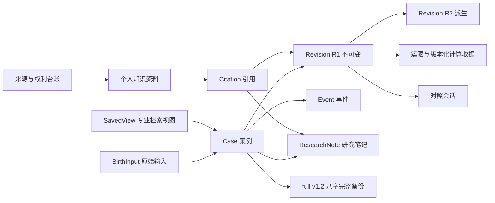

# 哈基米八字研究台：项目完善总纲与实施指引 v0.1

更新日期：2026-08-10  
文档性质：产品、领域、工程、发布与治理的总导航  
当前产品状态：八字 Web/PWA 研究预览；Web v1 尚未发布

> 本总纲不是发布公告，也不替代字段级协议。它负责说明“为什么做、先做什么、做到什么才算完成、哪些事情不能混为一谈”。实现事实以当前源码和绑定该源码的最新证据为准；产品取舍以用户明确决定为准；具体字段、Schema、备份和发布语义仍以相应专项协议为准。

## 0. 如何使用这份总纲

每次开始新工作前，按下列顺序执行：

1. 先看本总纲的当前基线、阶段路线和停止线；
2. 再打开对应专项文档，不凭历史聊天或旧交接猜协议；
3. 检查当前源码和未跟踪文件，不清理、不覆盖用户已有工作；
4. 为本次功能写出“用户价值、数据影响、失败行为、最小测试、发布影响”；
5. 完成后更新状态总账和证据，不把“实现了”写成“已发布”，也不把“工程一致”写成“专家正确”。

文档冲突时采用以下口径：

- 用户已经明确确认的产品决定优先；
- 当前源码决定“实际实现了什么”；
- 绑定源码基线的当前测试、真实浏览器、固定设备或专家签字决定“证明了什么”；
- 本总纲决定工作优先级和完成口径；
- 字段级专项协议决定数据和算法语义；
- 日期更早的总结、进展和交接只作历史快照。

统一状态词：

| 状态 | 含义 |
| --- | --- |
| 未开始 | 尚无可执行实现 |
| 已设计 | 已有边界或协议，但无完整实现 |
| 已实现未复验 | 当前源码存在，尚未绑定本轮证据 |
| 工程已验证 | 当前基线的自动测试、浏览器或设备证据已通过 |
| 发布候选 | 工程门已关闭，但仍等待产品、领域、平台或发布签字 |
| 已发布 | 唯一发布谱系、发布说明、恢复方案和证据均已签字 |

“专家已验证”“内容可分发”“工程已验证”是三条独立状态轴，任何地方都不得合并成一个含糊的“已验证”。

## 1. 北极星与不可妥协原则

### 1.1 一句话定位

一个面向简体中文八字学习者和研究者的、本地优先、规则可追溯、结果可复算、资料可恢复的专业研究工作台。

### 1.2 产品承诺

- 用户能看见原始输入、时间归一化、规则配置、计算引擎和版本；
- 同一冻结输入与规则可以重演，不依赖“当前最新版”偷偷重算历史；
- 案例允许派生新 Revision，但历史 Revision 不被覆盖；
- 研究结论可以附来源、范围、争议和证据状态；
- 数据默认仅在本机，由用户主动备份、恢复和分享；
- 升级失败时宁可只读、回退或明确阻断，也不产生可写半代；
- 外部实现用于发现分歧，不自动成为真值；
- 未来术数体系共享研究工作流，不共享不相容的事实、规则、金标和存储语义。

### 1.3 明确不承诺

- 不承诺预测准确率、吉凶结论或替用户做人生决策；
- 不把 13 个未知时辰探针描述成出生时辰反推或概率排序；
- 不把本地保存描述成加密；
- 不把匿名导出描述成无法再识别；
- 不把桌面快捷方式描述成已经签名、可分发的原生桌面应用；
- 不把紫微、西洋隔离草案描述成主产品已经支持；
- 当前不做 iOS、付费、云同步或项目托管 AI。

## 2. 当前事实基线

以下是 2026-08-10 当前源码和后继文档的总览。旧交接文件形成时间更早，只能作为当时快照。

| 范围 | 当前状态 | 判断与下一道门 |
| --- | --- | --- |
| 默认八字 Web 构建 | 工程身份已固定 | 普通 `npm run build` 必须继续为 `legacy-v13 / targetSchema 13` |
| v13→v16 | 隔离候选、待绑定复验 | 当前源码已有 12 场景 spec，文档记录 Edge/Chrome 12/12 与连续流 2/2；建立受控源码基线后再复验和决定是否晋级 |
| 八字 P0/P1 工程闭环 | 部分完成 | 主体流程已形成，但专业真值、内容权利和部分平台门未关闭 |
| P2-05 容量与性能 | 部分完成 | clean v16 子门有记录；CandidateSet-heavy、长备注、复杂查询、统一取消、内存/long task、固定 Android 仍缺 |
| 专家金标 | 未完成 | 360 配额中 60 `candidate`、0 `verified`；工程差分不能替代专家裁决 |
| 内置规则基线 | 工作默认 | 传统子平配置仍是 `working_default`，来源和现实顾问签字未完成 |
| 随包知识正文 | 未开始 | 内置典籍正文为 0；用户资料继续是本机未核验内容 |
| Web v1 | 未完成 | P0/P1/P2、真值、权利、平台与发布签字未全部关闭 |
| Windows 桌面入口 | 本机便捷入口 | 依赖源码、Node/npm 和本地 preview；不是正式桌面版 |
| Android | 后置 | 仅在八字、紫微斗数和西洋占星三个 Web 模块分别达到约定功能与独立质量门后建立 Capacitor 壳 |
| 紫微斗数 | 隔离工程预览 | 已有独立计算、保存、重开和备份竖切；无生产入口、专家真值或发布资格 |
| 西洋星盘 | 隔离诊断预览 | 已有工程诊断和无存储规则预览；无严格星历成功回执、正式保存或发布资格 |
| 仓库可追溯性 | 高风险未完成 | 当前 `master` 无提交、约数千个项目文件均未跟踪；不得擅自整仓提交或清理 |

当前还需立即核对并纠正的口径漂移：

- 分区数等诊断常量必须从契约派生，避免十五/十六等手写口径再次漂移；
- clean-start 配置注释与后继 Chrome 证据记录不一致；
- storage 包级历史默认和注释容易被误解为 Web 默认发布身份；
- Help 对紫微、西洋独立预览的描述落后于当前隔离实现；
- README、总账、验收矩阵和日期交接必须区分“历史记录”“当前基线复验”“发布签字”。

## 3. 用户、任务与完成定义

### 3.1 三类主要用户

| 用户 | 首要任务 | 界面策略 |
| --- | --- | --- |
| 初学者 | 正确录入、理解边界、保存和重开 | 默认概览、演示引导、中文解释、少量必要选择 |
| 进阶学习者 | 比较结构、规则和运限，积累案例 | 展开结构、时间线、事件、知识引用和对照 |
| 专业研究者 | 复演、版本核对、检索、批量研究和证据审计 | 技术详情、版本、摘要、来源、查询和维护者工具 |

不建立三套互不兼容的产品。三类用户使用同一份数据，通过标准视图、专家视图和维护者模式分层呈现。

### 3.2 Web v1 的完成定义

只有同时满足以下条件，才可称为 Web v1：

1. P0 可信计算与数据底座签字；
2. P1 完整研究工作流签字；
3. P2 Web/PWA 发布质量签字；
4. 默认规则、强验证范围和发布谱系已由用户确认；
5. 专家真值与内容权利达到已约定的首发最低线；
6. 支持浏览器、真实恢复、无障碍和隐私网络门通过；
7. 发布构建、数据迁移、回滚和帮助文案保持同一身份；
8. 所有完成声明绑定不可变源码或受控基线及证据清单。

独立紫微/西洋预览、测试数量增加、哈希一致或某一浏览器通过，都不能替代上述定义。

### 3.3 可验证的产品成功指标

这些是待执行的验收目标，不是当前成绩，也不通过隐藏遥测收集：

- 首次体验：10 名目标用户中至少 8 名能无协助用演示值完成排盘，并说出“仅本机、研究预览、太阳时是否采用、未知时辰不猜”；
- 专业可发现性：5 名专业研究者中至少 4 名能在 60 秒内找到规则、engine、tzdb、来源与 Revision 身份；
- 核心任务：首次排盘、重开、派生、对照、引用、导出和恢复的首选路径成功率至少 80%；
- 手机等价：360/390/412 px 均能完成七项核心任务，0 根页面横向溢出，主控件至少 44×44 px；
- 数据信任：第一次真实保存后两次交互内可达完整备份，恢复预检保持零写入；
- 发布完整性：支持矩阵中 0 数据丢失、0 可写半代，旧页只能安全收敛或进入明确恢复；
- 多体系隔离：主构建对计划体系的运行时代码、DB、SW 和 full v1.2 分区新增均为 0；
- 无障碍：自动 A/AA 门为 0 违规只是子门，人工 NVDA 与键盘脚本需 100% 完成约定核心任务。

指标通过定向可用性研究、测试清单和用户主动导出的本地诊断获得；默认不采集远程行为数据。

## 4. 产品对象与数据关系



关键规则：

- Case 是研究容器，不等于一张会被覆盖的命盘；
- Revision 一经保存不可变，新输入、规则或时间校准生成新 Revision；
- CandidateSet 是未知时辰的实验性对照集合，不是推断结论；
- Event、Note、Citation、Attachment 均有明确生命周期和删除边界；
- full v1.2 契约内固定八字十六用户分区语义；
- 紫微独立资料库采用自己的内容地址与 create-only 合并恢复，不能套用八字替换恢复语义；
- 未来多体系备份只能由上层容器装入彼此独立验真的子工件。

## 5. 核心用户旅程

### 5.1 首次进入

推荐主路径：了解“本机保存与研究预览” → 用演示值完成一次排盘 → 理解结果没有自动保存 → 再录入真实案例 → 第一次保存后完成备份提醒。

完成条件：用户能说出数据只在本机、太阳时是否采用、未知时辰不会被猜测、工程预览不是专家结论。

### 5.2 新建排盘与校时

四步保持清晰：出生信息 → 地点/时区 → 规则与时间校准 → 预览并显式保存。所有影响结果的选择都可见；标准视图可解释，专家视图可查看原始 ID、规则快照、engine、tzdb 与摘要。

完成条件：保存前后输入、UTC、民用时、太阳时、DST 选择和规则版本均可追溯。

### 5.3 保存、重开与修订

用户保存 Case/R1，重开核对，再从 R1 派生 R2；历史不被覆盖。回收站只改变生命周期，不悄悄删除关联记录。

完成条件：R1/R2 身份、来源、hash、收据和恢复行为可复验。

### 5.4 结构、运限与事件研究

从概览进入结构和运限纵向切片，把事件绑定到明确 Case、Revision 与时间节点；筛选和深链必须可恢复。

完成条件：刷新、返回、窄屏切换和备份恢复后仍回到同一研究上下文。

### 5.5 检索、SavedView 与对照

研究者能用严格 ResearchQuery 建立可复算查询，保存视图，并进行同 Case 多 Revision 或跨 Case 对照。跨体系出现前，只做八字内部对照。

完成条件：筛选条件、版本、请求摘要和结果身份可核验；取消不保存半成品。

### 5.6 知识、引用与来源权利

用户导入个人 Markdown/TXT，建立引用，查看来源角色、权利状态和依据覆盖。个人资料不会因被引用而升级为项目认可内容。

完成条件：引用能回到精确来源位置；作品权、版本权、证据质量各自显示。

### 5.7 导出、完整备份与恢复

匿名 Markdown 属于减少直接标识信息的分享，不等于不可再识别；full v1.2 是敏感完整备份。恢复必须先预检、提示安全备份、复核容量和并发，再原子提交。

完成条件：失败不产生半恢复；跨浏览器或目标设备往返后，所有分区、附件字节和摘要保持约定一致。

### 5.8 升级、失败与恢复

页面应解释当前处于冻结、审计、迁移、等待确认、自动收敛还是失败关闭；明确“哪些数据仍可信、哪些动作被禁止、如何只读导出或重试”。

完成条件：任何时刻只有完整旧代或完整新代可写；旧 BOOT_OK 不能确认新代；未保存表单和查询草稿在受控 reload 前有保护策略。

## 6. 信息架构与体验完善

### 6.1 主信息架构

- 工作台：最近研究、最近 SavedView、备份健康、主任务入口；
- 新建排盘：四步输入、校时、规则和保存；
- 案例库：分页、筛选、回收站、批量导入；
- 专业检索：ResearchQuery、条件摘要、SavedView；
- 命盘：概览、结构、运限、研读；
- 对照台：同 Case Revision 与跨 Case A—D；
- 知识与来源：个人资料、引用、权利台账、依据覆盖；
- 设置：常用设置、规则管理、维护者审计和诊断；
- 数据与备份：导入、完整备份、恢复、隐私清空；
- 帮助与恢复：边界、错误代码、只读出口和路线说明。

建议把导航“典籍与术语”统一为“知识与来源”，避免在随包正文为 0 时暗示已经提供典籍。

### 6.2 新手与专家分层

- 标准模式显示中文含义、关键选择、边界和下一步；
- 专家模式展开原始 ID、规则快照、engine、tzdb、hash、provenance 和收据；
- `working_default`、`resolved_unique`、`civil_time` 等内部词不应在普通路径裸露；
- Revision、CandidateSet 首次出现时必须带中文解释；
- 任何会改变结果的选择都不能为了“简单”而隐藏。

### 6.3 工作台优先级

首屏只保留一个明确主动作。首次用户推荐“用演示值走一遍”，已有案例用户推荐“继续最近研究”。CSV、专业查询和数据管理降为次级入口。

工作台应常驻显示：

- 未备份的新增/变更数量；
- 最近一次完整备份时间与是否验证；
- 浏览器存储可能被清理的风险；
- 单一“立即备份”行动；
- 升级或恢复异常时的只读出口。

### 6.4 设置分层

把当前混合设置拆成：

1. 常用显示与排盘偏好；
2. 数据与备份；
3. 规则包管理；
4. 维护者审计；
5. 诊断与版本信息。

维护者工具默认折叠，不让普通用户承担金标、历法审计和发布协议的认知成本。

### 6.5 桌面与手机等价

桌面使用侧栏、多列和依据栏；手机维持五项主导航、当前盘身份条、依据抽屉和专注式全屏流程。手机必须独立完成：排盘、研读、事件、两盘对照、知识引用、分享导出、备份预检。

固定检查 360、390、412 px、软键盘、safe-area、长中文和超长错误；全局预览条、顶栏和底栏不得共同挤压主任务或遮住提交按钮。

### 6.6 无障碍

- 语义标题、landmark、表格和状态关系正确；
- 全流程键盘可用，焦点不丢失、不陷阱；
- 触控目标至少 44×44 px；
- 支持强制色彩和 reduced motion；
- 200%/400% 重排不丢功能；
- 自动 axe 只是子门，还需 NVDA+Edge、Edge/Chrome 键盘和固定 Android 人工脚本。

## 7. 八字领域、规则与专家真值

### 7.1 六层事实模型

1. 用户原始输入；
2. 时间、历法、时区和太阳时归一化事实；
3. 确定性命盘事实；
4. 可争议、可版本化的规则配置；
5. 解释观点与研究假设；
6. 未来 AI 的整理或表达。

每层都必须在 UI、导出、引用和审计中标明身份，不能把解释写回事实字段。

### 7.2 三条独立状态轴

- 专业证据的持久化状态：`candidate → cross_checked → verified`；独立专家复核、第三方裁决和纳入 fixture 是进入 `verified` 前的审核步骤与记录，不是当前枚举值；
- 内容权利：`unknown / local_private_only → blocked / redistributable`；
- 工程状态：结构验真、摘要一致、单测、浏览器、固定设备。

只有三条轴都满足对应发布门，相关能力才可进入发布说明。

### 7.3 360 金标 SOP

1. 冻结输入、规则、来源快照、声明范围与摘要；
2. 两名不同且身份可核验的审核人独立作答；
3. 历法/天文、八字规则、典籍解释按能力范围签字，不越权；
4. 分歧交给与 A/B 均不同的第三裁决人；
5. 记录利益冲突、来源谱系、签名、理由和适用字段；
6. 维护者把裁决纳入版本化 fixture 后才增加 `verified` 数量；
7. 后续纠错新增 superseding 记录，不覆盖历史裁决。

当前通用金标总账只有两名 reviewer 和裁决摘要，第三位裁决身份尚未结构化；P0-03 专项历法差异契约已经结构化第三裁决身份，但尚未增加任何 `verified` 数量。必须在大规模填充金标前统一两者。

### 7.4 未知时间边界

- 13 个代表探针继续标记 `experimental_probe`；
- 不排序、不评分、不声称找到真实时辰；
- `hour_range` 与 `date_only` 要么补完整输入、区间和展示契约，要么从 v1 承诺中删除；
- 事件匹配只能是用户研究线索，不是概率真值。

### 7.5 知识与来源权利

- EvidenceSubject 从当前 36 个四柱字段逐步扩展到时间归一化、公农历、关系、起运、运限和规则判断；
- 来源角色必须区分权威历表、天文材料、古籍、顾问决定和工程实现；
- 典籍需记录作品、底本、校点/数字化版本、取得时间、hash 和精确定位；
- 先完成一部合法、完整、可复核的样板，再扩第二部；
- 用户导入内容始终是 `user_unverified / local_private_only`，若要进入随包库必须新建受控 curated 记录；
- 技术引用上限不是法律授权，面向中国大陆或全球分发都需单独权利审查。

## 8. 数据、本地优先与备份

### 8.1 数据分级

- 高敏：出生时间地点、坐标、别名、事件、笔记、附件、研究者资料；
- 可再识别派生：四柱、精确时区、运限和组合报告；
- 系统审计：版本、摘要、规则和来源状态。

所有 CSV、Markdown、PNG、PDF、JSON、ZIP 下载前显示敏感等级与用途。

### 8.2 本地优先的真实含义

- 默认无账号、无云同步；
- IndexedDB 和下载备份是本地明文，不声称加密；
- 浏览器可能清理数据，用户需主动下载备份；
- 他人出生资料应提示最小化收集和取得同意；
- 任何网络能力未来都必须显式开启、列明数据范围，并通过外网请求审计。

### 8.3 八字完整备份

- full v1.2 固定十六用户分区；
- `mutationState` 与内部派生索引不进入用户 payload；
- 旧格式先按旧契约验真，再逐版迁移；
- 恢复为完整替换语义，先安全备份、预检、容量复核和 CAS，再单事务提交；
- v0.1～v0.8 历史嵌套 Schema 仍共享当前类型别名的问题，需在 Web v1 前冻结；
- 大库、分卷、Worker 中止、配额和 Android SAF 另设专项门。

### 8.4 独立术数资料库

紫微当前独立资料库使用独立 DB、Revision 工件、epoch/CAS 和 create-only 原子合并恢复。它不能读写八字 DB，也不能扩宽 full v1.2。西洋若未来持久化，必须建立自己独立的契约、数据库和备份，不复制紫微或八字语义。

## 9. 架构、发布、Schema 与 Service Worker

### 9.1 目标依赖方向

```text
contracts / integrity
        ↓
deterministic cores
        ↓
storage / backup / platform ports
        ↓
apps/web
```

隔离草案只能通过受审入口构建，保持 private、空 exports、生产不可达。普通生产 bundle、DB、full v1.2、SW 和 Help 主导航都不得偷偷包含草案运行时。

### 9.2 默认发布身份

- 在用户明确晋级并完成全部发布门之前，普通 `npm run build` 固定输出 `legacy-v13 / targetSchema 13`；
- v14/v15 只保留历史候选；
- v13→v16 只能通过显式 candidate 配置构建到独立目录；
- 测试通过不会自动提升默认代；
- 晋级必须由用户明确决定并更新发布描述符、迁移谱系、恢复说明和证据清单。

在晋级前必须确认：v14/v15 是否曾部署到任何真实用户 origin。若曾部署，不能把 v13→v16 直接称作全用户唯一升级路径。

### 9.3 多标签收敛不变量

- 任一时刻至多一个完整代可写；冻结、迁移和失败关闭窗口允许零代可写；
- 旧页在冻结后保持 inert 和写锁；
- 旧 `BOOT_OK` 不得确认新代；
- 未绑定旧页只能收到精确的代际收敛信号，再通过安全导航绑定；
- 容量不足、事务中止、目标审计失败、BOOT_OK 中断、陈旧 target 和 CAS 冲突都不能改变已确认旧代；
- Cache Storage 与 IndexedDB 是可恢复两阶段协议，不宣称跨 API 严格原子事务。

### 9.4 mutation epoch/CAS

- 每个已提交业务 readwrite transaction 只推进一次 epoch；
- 写锁检查在 bump 前；
- snapshot、fingerprints 和 epoch 来自同一只读事务；
- 只有 expected epoch 未变化才写 clean marker；
- marker 缺失、损坏或身份漂移走 full audit 或失败关闭；
- 不允许用绕过 epoch 的 raw IndexedDB 写入构造 v16 成功数据。

### 9.5 桌面入口

当前快捷方式属于本机便捷入口。继续维护其互斥、strictPort、身份校验、失败只杀自身进程和日志边界；如要对外称“桌面版”，必须另做可分发安装、签名、更新、卸载、进程生命周期和无 Node 环境门。

## 10. 质量、测试与证据策略

### 10.1 轻测试、重功能的执行方式

日常功能切片采用最小充分证据：

1. 相关纯函数/仓储/组件定向测试；
2. 受影响包 typecheck；
3. 一条真实主流程浏览器 smoke；
4. 若影响构建、发布或边界，再跑普通 build 和对应门禁。

不为每个文案或小布局改动重跑十分钟级矩阵；但以下改动必须进入重门：Schema、SW、备份恢复、epoch/CAS、权限/隐私、来源真值、跨浏览器行为、固定设备和发布身份。

### 10.2 证据层级

| 层级 | 内容 | 能证明什么 |
| --- | --- | --- |
| L0 | 契约、纯函数、摘要 | 局部确定性和拒绝行为 |
| L1 | storage、Worker、事务 | 原子性、回滚、并发和容量边界 |
| L2 | 组件与页面 | 交互状态和无障碍子门 |
| L3 | 单浏览器真实流程 | 一个具体运行时的端到端行为 |
| L4 | Edge/Chrome/Firefox 发布矩阵 | 支持浏览器中的升级、恢复和兼容性 |
| L5 | 固定 Android、系统 UI、人工读屏 | 设备、WebView、文件、分享、打印和人工可用性 |
| 专家 | 现实复核与裁决 | 领域声明，而非工程行为 |

### 10.3 证据清单

每个发布门保存：

- 源码树摘要或 commit；
- 构建 descriptor、build hash 和发布身份；
- 精确命令、浏览器/OS/设备版本；
- 开始结束时间与结果；
- trace、日志、截图或人工记录；
- 失败样例及是否重跑；
- 证据属于工程、设备、专家还是权利审计。

未绑定 commit 或精确源码树摘要的旧测试数字，不得描述成“当前代码已通过”；绑定受控基线后方可这样声明。

### 10.4 支持矩阵

最低建议：Edge 与 Chrome 为 Web 发布主门；Firefox 是否列入首发由用户决定。固定 Android Chrome 的移动 Web/PWA 体验属于 Web v1 前的平台门；Capacitor/WebView/APK 壳属于 Web v1 后的 Android 阶段。PWA standalone、系统分享、打印和文件选择需真实系统 UI 证据，不能由 DOM 模拟代替。

## 11. 性能、容量、取消与资源治理

性能按场景分账：首次安装、首次迁移、dirty 启动、clean 启动、查询、打开案例、备份、恢复、取消。不能把 clean v16 约 1 秒的子门外推成整个产品 5 秒 SLA。

P2-05 剩余必做：

- CandidateSet-heavy 数据集；
- 长备注、长研究笔记和二进制附件；
- 复杂 ResearchQuery 与连续深翻；
- 查询和其他批任务的真实中止；
- 内存峰值、PerformanceObserver long task、存储占用和配额；
- 取消/失败后的 Worker、事务和内存释放；
- Edge、Chrome 与固定中端 Android 分别记录预算。

预算只有在设备和数据集冻结后签字；未冻结前报告测量值和环境，不写虚假的统一 SLA。

## 12. 安全、隐私与合规

### 12.1 最高风险

同源 XSS 可读取本机数据库，是 local-first 产品的首要数据风险。生产发布前应建立威胁模型和托管安全基线：

- CSP 与安全响应头；
- `script-src 'self'`、`object-src 'none'`、`base-uri 'none'`、`frame-ancestors 'none'` 和受控 `connect-src`；
- 评估 Trusted Types；
- 依赖审计、SBOM、许可证、secret scan；
- 生产 history fallback 与错误页；
- 外网零请求或显式 allowlist 审计；
- 敏感 sentinel 不进入日志和诊断。

### 12.2 本地诊断

默认不建立远程遥测。诊断采用版本化、本地、用户主动导出的 allowlist，只记录阶段、耗时、错误码、descriptor、build、migration 和 epoch 状态，不记录案例正文、别名、笔记、附件或未经清洗的异常栈。

### 12.3 合规边界

- 工具不代替医疗、法律、财务等专业决定；
- 收集他人出生资料时提示同意、最小化和删除；
- 中国大陆分发与全球 Web 分发的内容、隐私、密码和许可要求需分别审查；
- 未完成法律审查时只记录事实与风险，不写“已合法”结论。

## 13. 平台路线

### 13.1 Web/PWA 先行

先关闭 Web v1 数据、发布、恢复和无障碍门。补齐生产托管、PWA 独立窗口、浏览器矩阵、系统分享/打印和现实恢复演练。

### 13.2 Android 后续阶段

八字 Web v1 仍先独立关闭自己的发布门；紫微斗数和西洋占星继续按各自准入阶梯完成 Web 功能。只有三个 Web 模块都达到用户约定的功能与独立质量门后，才开始 Android：

1. 建立最小 Capacitor 壳，不复制计算和研究逻辑；
2. 接入 SAF/Filesystem、系统分享、返回键、打印和字体；
3. 验证离线重启、后台回收和 WebView 升级；
4. 使用同一 full v1.2 做 Web↔APK 往返和命盘 hash 核对；
5. 固定中端设备矩阵后再生成和验收签名 APK/AAB。

Android 不能用来掩盖 Web 红灯；iOS 继续不在当前范围。

## 14. AI 边界

Web v1 推荐不接入云 AI。未来如启用，先做只读、引用驱动的资料整理：

- AI 不重算四柱、不写回确定性事实、不替代规则引擎；
- 每段输出保留引用、模型、提示版本和时间；
- 默认不上传完整案例，用户明确选择字段；
- 不内置项目密钥；BYOK 或项目服务另行决策；
- AI 输出固定标记为生成内容，不能升级证据或专家状态。

## 15. 多术数准入与跨体系边界

统一准入阶梯：

```text
planned
→ diagnostic_only
→ contract_frozen
→ deterministic_engine_candidate
→ independent_differential
→ expert_reviewed_fixture
→ isolated_persistence_candidate
→ browser/device_release_candidate
→ active
```

每个体系都必须独立完成：

- 输入和领域契约；
- 规则 Profile 与版本；
- 冻结引擎和重演；
- 来源、许可与独立差分；
- 专家 fixture；
- 数据库、备份、恢复和多标签；
- 容量、Edge/Chrome 与目标设备；
- 显式发布决定。

八字金标、EvidenceSubject、具体 Revision Schema/记录、DB 和 full v1.2 不得借给紫微或西洋；各体系可以通过版本化适配器共享“不可变 Revision”这一工作流模式。第二体系真正 `active` 前，主应用不显示可点击体系切换器。

### 15.1 紫微下一步

- 将当前独立工程工件升级为完整、可审阅的领域 fixture；
- 冻结真实规则 Profile、来源和顾问签字；
- 补容量、多标签、故障、恢复和双浏览器/设备矩阵；
- 明确 iztro/Fortel 只做具名工程差分；
- 通过独立发布门后才考虑进入主壳。

### 15.2 西洋下一步

- 锁定官方 JPL 原始响应或等价可审计星历工件；
- 关闭闰秒、EOP、时间尺度、目标中心和参考系语义；
- 建立严格成功回执和许可证结论；
- 建立独立保存、检索和备份竖切；
- 再进入专家规则审核和浏览器/设备发布候选。

### 15.3 首个跨体系功能

只能是冻结事实、规则身份和来源的只读并列，不做一致率、综合评分、吉凶合成或自动人物合并。人物关联必须由用户显式建立。

## 16. 同类产品与相邻工作流的启发

以下只用于学习工作流，不复制品牌、资产、页面或专有内容；产品能力以各官网自述为准，不作为独立质量结论。

| 层级 | 参考 | 可借鉴 | 不借鉴 |
| --- | --- | --- | --- |
| 直接同类 | [问真八字](https://www.iwzbz.com/) | 详细排盘、真太阳时、笔记、术语提示的任务路径 | 视觉、资产、预测文案、付费/AI主导路线 |
| 专业工具 | [Solar Fire](https://www.astrologysuite.com/) | 规则选项、工作区深度、报告和专业配置 | 未建立真值前盲目追求功能广度 |
| 专业工具 | [Astrodienst Extended Chart Selection](https://www.astro.com/horoscopes/chart.aspx) | 把复杂参数组织成可审计的配置，而不是隐藏默认值 | 直接搬用西洋语义到八字 |
| 证据库 | [Astro-Databank](https://www.astro.com/astro-databank/Astro-Databank%3Aabout) | 出生资料来源、可信度和来源注释的独立管理 | 复用其数据、评级或把评级当本项目真值 |
| 研究资料 | [Zotero Collections and Tags](https://www.zotero.org/support/collections_and_tags) / [Notes](https://www.zotero.org/support/notes) | 同一资料可进入多集合、标签、相关项、笔记和保存检索 | 把知识库变成无边界文件仓库 |
| 可复现导入 | [OpenRefine Operations](https://javadoc-v4.openrefine.org/org/openrefine/operations/operation) | 保存 CSV 映射/清洗步骤、可预览、可重放、可撤销 | 任意脚本直接改正式库 |
| 研究叙事 | [Jupyter Narrative Notebooks](https://docs.jupyter.org/en/stable/use/use-cases/narrative-notebook.html) | 长期可考虑“研究会话工件”：数据、步骤、笔记、引用并列 | 在生产应用开放任意代码执行 |

本项目的差异化不是“功能最多”，而是：本地优先、不可变 Revision、规则/引擎/时区可追溯、备份恢复可证明、证据状态诚实。

## 17. 工程治理与仓库基线

### 17.1 受控初始基线

当前所有项目文件未跟踪。建立 Git 基线前必须：

1. 列出文件、生成物、测试产物、下载资料和本地运行状态；
2. 明确 secrets、浏览器 profile、数据库、日志、备份和临时目录；
3. 建立精确 `.gitignore`；
4. 对将纳入范围生成文件清单和 hash；
5. 由用户授权后才创建受控初始 commit；
6. 以后所有证据绑定 commit、构建 descriptor 和环境。

本总纲不授权自动提交、暂存、删除或重置。

### 17.2 架构和依赖治理

- 建立通用 workspace 依赖方向门，不只检查术数草案；
- 普通 bundle 检查不得包含 draft 包或隔离引擎；
- 外部依赖锁 exact version、来源、SRI、许可证和修改记录；
- 生产与隔离预览分别生成 SBOM；
- 能 fork、能访问或标注“开源”不等于可按当前分发方式使用。

### 17.3 版本注册表

统一登记：app、release generation、DB Schema、SW build、domain schema、engine、rule profile、tzdb、backup、validator/Worker、诊断 Schema。禁止用 storage 的最大 Schema 推断 Web 默认发布代。

### 17.4 维护、反馈与故障分级

- P0：数据损坏、可写半代、隐私外传、发布身份漂移、草案越界；立即停止发布并保留现场；
- P1：核心流程不可用、恢复失败、规则/来源状态误导、支持浏览器严重回归；优先于新增功能；
- P2：局部体验、文案、布局和非核心性能问题；按功能切片合并处理；
- 用户反馈先记录复现环境、数据敏感等级、版本和预期，不要求上传完整资料；
- 发布说明必须包含用户可见变化、数据/Schema 影响、备份建议、已知限制和回滚方式；
- 依赖、浏览器、tzdb 和规则更新按固定节奏审查，不使用无门禁的自动大版本升级。

## 18. 分阶段实施路线

### S0：保护基线与纠正状态

- 用户确认是否允许建立受控 Git 初始基线；
- 修复分区数、clean-start 注释、Help 和 storage 默认口径漂移；
- 确认 v14/v15 是否曾真实部署；
- 把默认 v13 身份、草案不可达和文档一致性变成自动门；
- 对当前代码重跑必要全量门，生成证据 manifest。

出口：任何后续“通过”都能绑定可识别源码，默认发布身份无歧义。

### S1：把首个用户闭环做顺

- 首次演示引导；
- 标准/专家分层；
- 首次真实保存后的备份健康提醒；
- 设置 IA 拆分；
- 未保存表单/查询草稿在升级 reload 前保护；
- 手机七项任务与人工无障碍脚本。

出口：新手能完成演示和备份，研究者能在 60 秒内找到版本与来源。

### S2：关闭 P2-05 与发布质量

- CandidateSet-heavy、长文本、复杂查询、真正取消；
- 内存、long task、存储报告；
- Firefox 是否支持的决定及相应门；
- 生产 CSP/headers/history fallback；
- 真实 PWA、分享、打印、恢复演练；
- 冻结历史备份嵌套 Schema。

出口：Web/PWA 工程发布门不再依赖外推或旧记录。

### S3：并行关闭专业真值和内容权利

- 用户确认默认子平 Profile 与强验证范围；
- 建立审核人、第三裁决人和签名 SOP；
- 完成 360 金标计划；
- 扩展 EvidenceSubject；
- 完成一部合法随包典籍样板或明确首发正文为 0；
- 解决主要历法差异窗口。

出口：首发声称的每项领域能力都有相符的专家与权利证据。

### S4：Web v1 发布候选

- 固定唯一升级谱系；
- 连续跑完 v1 验收矩阵；
- 发布说明、帮助、诊断、恢复和数据格式口径一致；
- 用户签字决定默认发布代；
- 留存发布和回滚证据。

### S5：完成紫微与西洋 Web 模块

- 紫微从隔离工程预览推进到独立专家真值、容量、故障和浏览器发布候选；
- 西洋先关闭严格星历、时间尺度和来源门，再完成独立持久化、恢复与浏览器发布候选；
- 两者不得借用八字金标、数据库、Revision Schema 或 full v1.2；
- 两个模块完成后再评估共同工作台入口与只读跨体系并列。

### S6：Android

按第 13.2 节建立最小 Capacitor 壳并完成固定设备矩阵；不同时扩张 iOS、AI 或付费。

## 19. Must / Should / Later

### Must：Web v1 前

1. 受控源码与证据基线；
2. 默认规则、强验证范围和真实部署谱系决定；
3. 状态、术语、分区数和多体系口径统一；
4. 首次演示→真实保存→备份引导；
5. 标准/专家视图分层；
6. P2-05 剩余重数据、取消、内存和设备门；
7. 360 金标 SOP、专家身份和裁决；
8. 内容权利最低线；
9. CSP、生产托管、隐私网络和现实恢复；
10. 支持浏览器、人工键盘/读屏和发布谱系签字。

### Should：Web v1 后首轮

1. 设置与维护者模式拆分；
2. 上下文术语词典和技术详情；
3. 最近研究、SavedView 与备份健康统一活动流；
4. 专业查询模板与严格条件摘要；
5. CSV 映射/清洗配方与重放历史；
6. 小规模可用性研究和信息密度迭代；
7. 加密备份或应用锁的独立格式设计（若用户不把它列为 v1 必须）。
8. 紫微斗数生产 Web 竖切；
9. 西洋占星严格星历与生产 Web 竖切。

### Later

- Android 正式交付；
- 体系切换器与只读跨体系并列；
- BYOK AI 研究助手；
- 云同步、iOS、付费和项目托管 AI 需重新立项。

## 20. 任一功能的完成定义

每个功能合入前必须回答：

1. 用户在什么场景下得到什么结果？
2. 标准模式和专家模式分别看到什么？
3. 创建、修改、删除、导入、导出哪些数据？
4. 是否影响 Revision、backup、Schema、SW、epoch/CAS 或发布身份？
5. 加载、空态、无权限、损坏、容量不足、取消和中断时如何失败？
6. 是否涉及来源、权利、专家真值或敏感数据？
7. 手机、键盘、读屏和打印/分享如何完成？
8. 最小充分测试是什么，哪一道重门必须留到发布矩阵？
9. 证据绑定哪一个源码基线？
10. README、帮助、验收矩阵和版本注册表是否需要同步？

缺少数据破坏分析、失败关闭行为或当前证据时，不得宣称完成。

## 21. 风险登记与停止线

| 风险 | 停止线 |
| --- | --- |
| 仓库无基线 | 用户已授权在完成范围、敏感文件和忽略规则审计后建立受控初始基线；审计前仍不得整仓提交、清理、重置或覆盖 |
| 默认发布漂移 | 普通 build 不是 legacy-v13 时立即停止发布工作 |
| 部署谱系不明 | 未确认 v14/v15 真实部署历史前，不晋级 v16 |
| 数据不变量破坏 | 出现可写半代、CAS 绕过、半恢复或 Revision 覆盖时停止功能扩张 |
| 专家真值冒充 | 差分/哈希/第三方一致被写成“准确”时停止发布文案 |
| 权利不明 | 无许可或底本不明的正文、图片、字体、案例不得随包 |
| 隐私外传 | 出现非预期网络请求、敏感日志或未授权上传时按 P0 处理 |
| 多体系串库 | 草案进入八字 bundle、DB、SW 或 full v1.2 时停止构建 |
| 性能外推 | clean 子门被写成整体 SLA 时撤回结论 |
| 平台冒充 | DOM 模拟被写成系统分享/打印/安装/真机通过时撤回声明 |

## 22. 已确认决定与剩余裁决

### 22.1 2026-08-10 已确认

| 事项 | 决定 |
| --- | --- |
| v14/v15 部署历史 | 当前不确定；必须审计真实 origin、旧发布记录和浏览器库存，查清前不得晋级 v16 |
| Git 初始基线 | 已授权；仅在排除敏感文件、浏览器 profile、生成物和运行状态并形成清单后建立 |
| 数据方式 | 纯本地、无账号、无云同步，由用户主动备份 |
| 随包古文 | v1 允许正文为 0，古文、合法版本和校勘内容以后补充 |
| Android 顺序 | 先完成八字、紫微斗数和西洋占星三个 Web 模块的约定功能与独立质量门，再进入 Android |

### 22.2 仍需用户裁决

推荐默认项写在斜杠前，用户可直接改：

1. 首次体验：**演示引导+概览优先** / 专业模式优先；
2. 流派基线：**传统子平作为首个工作 Profile** / 另指定流派；
3. 默认规则：换日、早晚子、真太阳时和起运由哪位顾问、哪组来源签字；
4. 强验证年份：**先锁 1900～2100，范围外实验性** / 首版必须覆盖古代命例；
5. 备份：**v1 保持敏感明文+强提醒，加密列后续** / v1 前必须口令加密；
6. AI：**排除 Web v1** / 以后 BYOK / 项目服务；
7. 专家制度：两名独立复核人、第三裁决人和规则顾问由谁担任；
8. 支持浏览器：**Edge+Chrome 首发，Firefox 补证后加入** / Firefox 首发硬门；
9. 多体系公开：**Help 准确说明有隔离预览但不给主入口** / 仅研发文档可见；
10. 跨体系长期边界：**先只读并列** / 未来允许版本化综合规则；
11. 分发范围：中国大陆优先 / 从一开始按全球 Web 审查。

可按下面格式回复最关键决定，其余继续采用推荐默认：

```text
1：演示优先 / 专业优先
2：传统子平 / 另有流派
3：请给一套待顾问确认的默认方案 / 我提供规则与顾问
4：1900～2100 / 包含古代命例
5：明文强提醒 / v1 必须加密
6：AI 排除 v1 / BYOK / 项目服务
8：Edge+Chrome / Firefox 也要首发
```

## 23. 文档地图

- 产品边界：[产品方向更新 v0.2](./产品方向更新-v0.2-专业研究版.md)
- 信息架构：[Web 研究工作台信息架构](./Web研究工作台信息架构-v0.1.md)
- 功能签字：[v1 功能验收矩阵](./v1功能验收矩阵-v0.1.md)
- 发布协议：[跨 Schema 数据库与 Service Worker 发布协议](./跨Schema数据库与ServiceWorker发布协议-v0.1.md)
- 容量：[P2-05 案例库容量基线](./P2-05案例库容量基线-2026-08-04.md)
- 原子性：[P2-05 原子完整性审计协议](./P2-05原子完整性审计协议-v0.1.md)
- 规则与金标：[八字规则配置与金标准计划](./八字规则配置与金标准计划-v0.1.md)
- 时间边界：[时间归一化与金标边界](./时间归一化与金标边界-v0.2.md)
- 多体系：[多术数融合扩展边界](./多术数融合扩展边界-v0.1.md)
- 紫微：[紫微斗数契约草案与来源门](./紫微斗数契约草案与来源门-v0.1.md)
- 西洋：[西洋星盘契约草案与来源门](./西洋星盘契约草案与来源门-v0.1.md)
- 历史交接：[项目正式总结与后续工作交接](./项目正式总结与后续工作交接-2026-08-10.md)

## 24. 建议立即启动的三个工作包

### WP-0：受控基线与状态纠偏

只读清单、`.gitignore` 设计、敏感/生成物审计、状态词和诊断常量纠偏、部署历史排查、证据 manifest 设计。用户已经授权：完成审计并明确纳入/排除清单后，可以建立受控初始 commit；`tmp/` 浏览器 profile、token 数据库和运行缓存不得进入。

### WP-1：首次体验与备份健康

把首次主动作收敛为演示引导；真实保存后显示备份健康；标准/专家信息分层；保护升级 reload 前未保存草稿。采用定向组件测试、typecheck 和一条 Edge/Chrome 主流程，不启动全矩阵。

### WP-2：P2-05 重数据与资源报告

建立 CandidateSet-heavy、长文本和复杂查询固定数据集，补取消、内存、long task、存储占用和资源释放报告。发布前再跑完整 Edge/Chrome/固定 Android 门。

专家真值和内容权利作为现实依赖，与三个工程工作包并行推进，不允许用代码替代签字。
